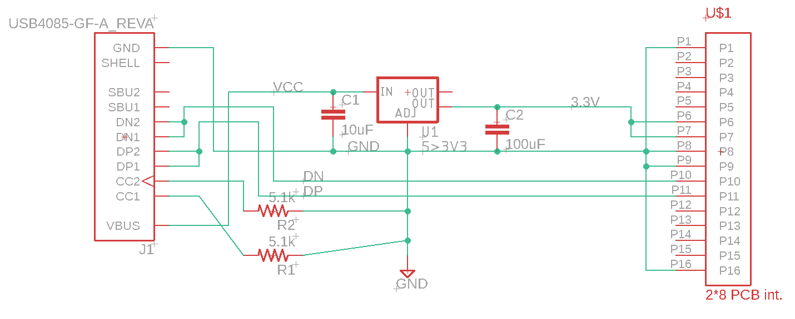
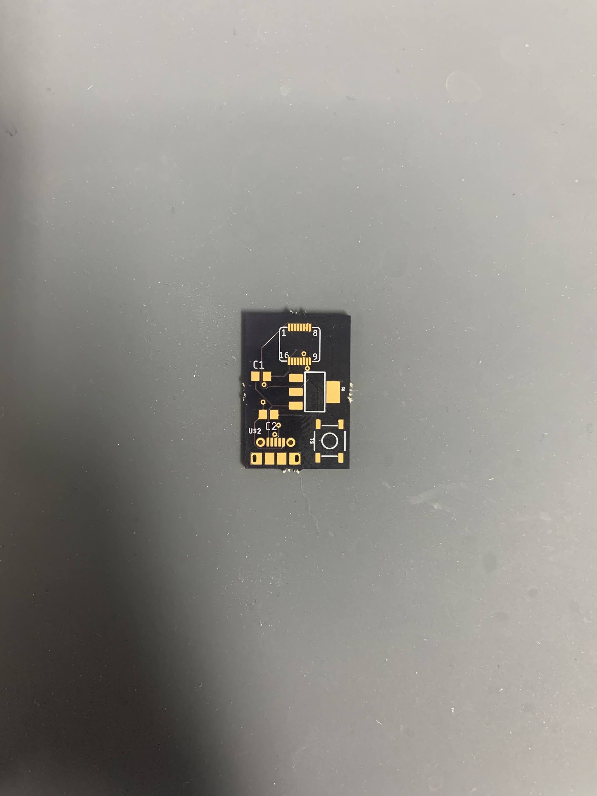
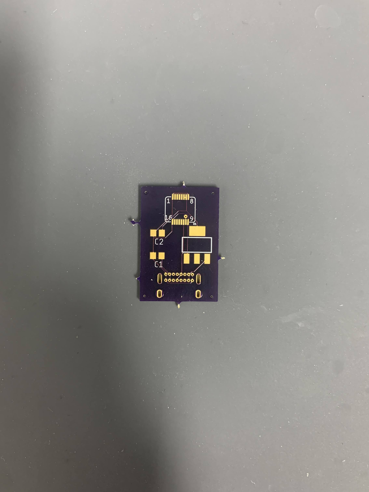
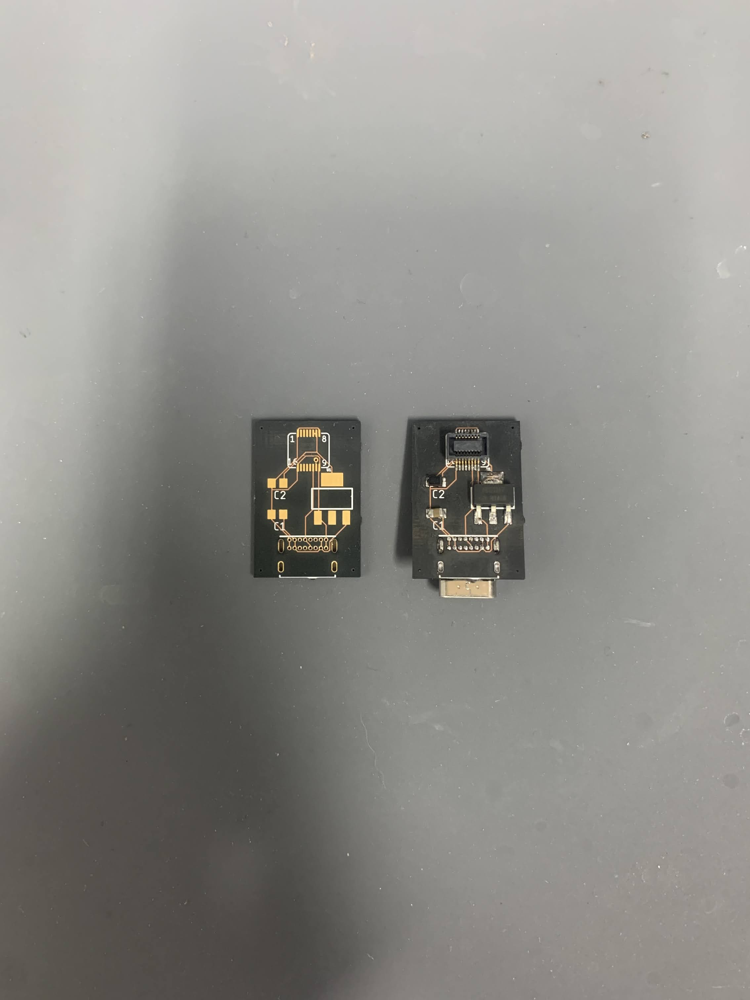
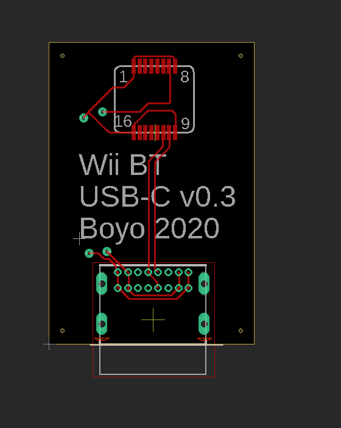
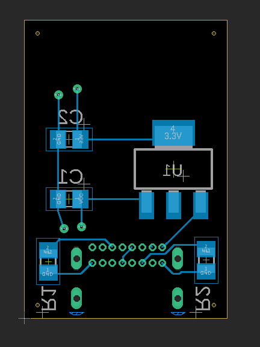

## The Concept
The Dolphin emulator, which is an emulator for the Nintendo Wii, has the ability to use physical Wiimotes through the use of ['Bluetooth](https://dolphin-emu.org/blog/2016/10/24/bluetooth-passthrough/) [Passthrough'.](https://wiki.dolphin-emu.org/index.php?title=Bluetooth_Passthrough) The idea is that instead of emulating the Wiimote or dealing with the OS and it's Bluetooth stack and whatever it decides to do to the Wiimote, you bypass most of the controller emulation by simply not emulating the Wii Bluetooth adapter. I won't go into it too much, but basically you can use any bluetooth adapter, but the ones that have the greatest compatibility are the ones that come directly from the Wii, as in if you open your Wii, you can take it out and connect it to your computer (with some janky wiring). This works because the adapter itself is connected through USB within the Wii and which means it can be connected to a computer. 

## Adapter Documentation
The adapter itself has been well documented and reverse engineered by both those on the [Dolphin Forum](https://forums.dolphin-emu.org/Thread-how-to-wire-a-wii-s-bluetooth-module-to-a-pc-usb-port) and those on the [BitBuilt Fourm](https://bitbuilt.net/forums/index.php?threads/the-definitive-wii-trimming-guide.198/). The BitBuilt members ShockSlayer and Cheese were the ones who figured out that shorting all three 3.3v pads turns the module on aswell as figuring out that the sync pad had to be connected to 3.3v to turn on the Wii side sync function.

## Circuit Design
Overall the circuit is not complicated at all, [Shank](https://forums.dolphin-emu.org/Thread-how-to-wire-a-wii-s-bluetooth-module-to-a-pc-usb-port?page=7), better known as [Shank Mods on Youtube](https://www.youtube.com/channel/UCUCo_G9HneFK4Luncw6v-Bw), over on the Dolphin Forum made a diagram with a 3.3v linear regulator that pretty much shows how it should be wired up.

  

I added a few things, and when I was first designing this I had no idea how to use any ECAD software and also had no idea how electronics worked other than one lead of an LED needs a resistor, and the other needs to go to ground, so I referenced the [bt-module-connector repository](https://github.com/dolphin-emu/bt-module-connector) on the dolphin-emu github to start my first attempt. Now this initial attempt was around September 2018 and I have had a lot of time to improve on my design of this. This is what the latest, and hopefully final, revision of the schematic looks like:

  

Everything is there to deal with power delivery and data transfer, all through a USB-C port. The two pulldown resistors are there for setting it as a powersink device to allow power from USB-C to USB-C cables. There are decoupling capacitors for the voltage regulator and the molex connector to connect the Bluetooth module to the pcb.

## PCB
The PCB has gone through a good number of revisions, with the current revision (as of writing this) being version 0.3. Granted I wasn't very good at version control the first time I did this, so there are actually 4 revisions, but I realized this after I sent the v0.3 boards to the fab, and the first board had no silkscreen for any project information on it.

#### v0

  
  

#### v0.1
From v0 to v0.1, I changed the layout of the components, swapped from mini-USB to USB-C, removed the sync button as Dolphin has a software sync button, and added some silkscreening for the board revision and other info.

  
   

#### v0.2
The changes between v0.1 and v0.2 is the fact that I realized the USB-C port had to be on the other side of the board as there was no clearance for the Bluetooth module.

  
   

#### v0.3
v0.2 to v0.3's changes stem from the fact that I cannot have any other components on the side of the board with the Bluetooth module as even a 0805 capacitor was too tall. I also added the pulldown resistors or else there would be issues using a USB-C to USB-C cable.

  
   

Theoretically this should all work, as in others have tested either hand wired or pcb's with similar if not the same schematics.

# Conclusion
(not finished with project yet, will update in a few weeks when v0.3 boards arrive)

